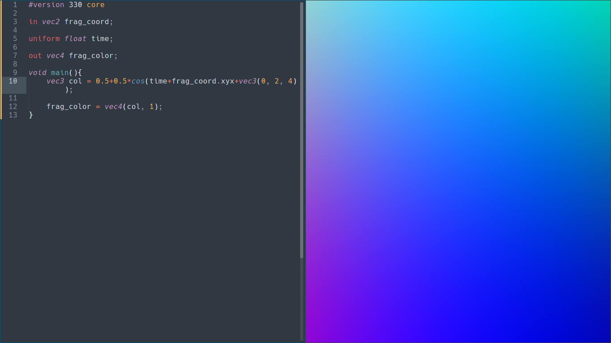

# GLSL Viewer

Like [Shadertoy](https://www.shadertoy.com/), but for desktop. Works on Windows and Linux.



## Usage

Compile using one of the build scripts:

```
./build_linux.sh gcc
or
build_windows.bat gcc
```

Then run the program in a directory with a `shader.glsl` file in it:

```
./glsl-viewer
```

The shader is reloaded in realtime if modified.

The following uniforms are supported:


| Type | Name  | Description |
| - | - | - |
| float | time  | Number of seconds since start |
| vec2 | resolution  | Viewport resolution (width, height) |
| vec2 | mouse  | Current mouse position |